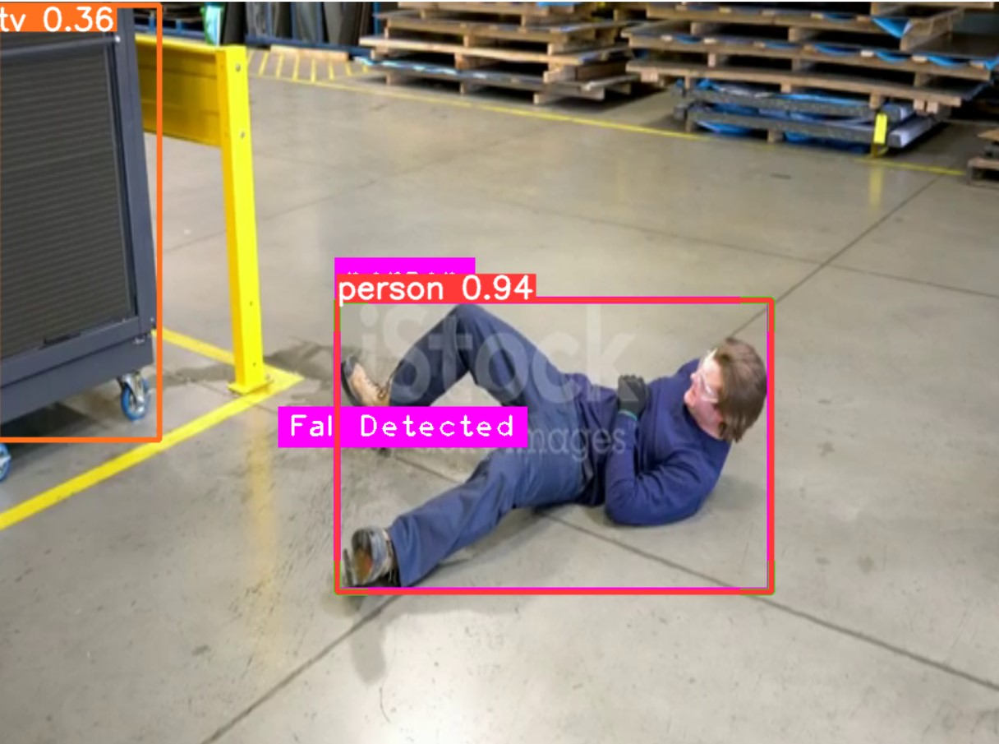

Here's the updated README file reflecting the use of YOLO-NAS for human detection and YOLOv8 for fall detection, along with the usage of separate files for each task:

---

# GuardianGaze

[](https://github.com/yourusername/GuardianGaze/actions)
[](https://opensource.org/licenses/MIT)
[](https://www.python.org/downloads/release/python-380/)
[](https://github.com/yourusername/GuardianGaze/graphs/contributors)

## Overview

GuardianGaze is an open-source fall detection system developed for CCTV inference of human fall detection. It can be used by guardians or owners to detect sudden falls of infants or elderly persons, providing real-time alerts and ensuring timely assistance.

## Features

- **Human Detection**: Uses YOLO-NAS for accurate human detection in images and videos.
- **Fall Detection**: Uses YOLOv8 for detecting fall events.
- **Video Interface**: Real-time fall detection in video streams.
- **Image Interface**: Fall detection in static images.
- **User-Friendly Interface**: Easy to use and integrate into various applications.

## Table of Contents

- [Installation](#installation)
- [Usage](#usage)
  - [Image Interface](#image-interface)
  - [Video Interface](#video-interface)
- [Training](#training)
- [How It Works](#how-it-works)
- [References](#references)
- [Contributing](#contributing)
- [License](#license)
- [Contact](#contact)

## Installation

To get started, clone the repository and install the required dependencies.

```bash
git clone https://github.com/KoustavD1423/GuardianGaze.git
cd GuardianGaze
pip install -r requirements.txt
```

## Usage

### Human Detection (YOLO-NAS)

The human detection script using YOLO-NAS is provided in a Jupyter notebook (`human_object_detector.ipynb`). To run the notebook, you can use the following command:

```bash
jupyter notebook human_detection.ipynb
```

### Fall Detection (YOLOv8)

For detecting falls in images or video streams using YOLOv8, use the provided `main.py` script.

#### Image Interface

For detecting falls in images, use the following command:

```bash
python main.py --source path/to/image.jpg
```

#### Video Interface

For detecting falls in video streams, use the following command:

```bash
python main.py --source path/to/video.mp4
```

## Training

To train the models on your own dataset, follow these steps:

### Training YOLO-NAS for Human Detection

1. Prepare your dataset in the YOLO-NAS format.
2. Open the `human_detection.ipynb` notebook.
3. Follow the instructions in the notebook to configure the training parameters and start the training process.

### Training YOLOv8 for Fall Detection

1. Prepare your dataset in the YOLOv8 format.
2. Configure the training parameters in `config.yaml`.
3. Start training:

```bash
python train.py --config config.yaml
```

## How It Works

### Overview

GuardianGaze leverages the YOLO-NAS model for detecting humans and the YOLOv8 model for identifying falls. The system processes both video and image inputs, providing real-time fall detection capabilities that can be integrated into surveillance systems, healthcare monitoring, and other applications where fall detection is critical.

### Human Detection with YOLO-NAS

YOLO-NAS is a neural architecture search (NAS) based variant of the YOLO model that is optimized for high accuracy and speed. It operates by dividing the input image into a grid and predicting bounding boxes and class probabilities for each cell in the grid. This approach allows YOLO-NAS to detect multiple objects in a single pass through the network, making it highly efficient for real-time applications.

In this project, YOLO-NAS is fine-tuned to specifically detect humans. The model is trained on a dataset of images containing humans, allowing it to accurately identify people in various poses and environments.

### Fall Detection with YOLOv8

Once the human detection model identifies a person in the input image or video frame, the next step is to determine if a fall has occurred. The fall detection mechanism relies on a combination of posture analysis and motion patterns.

#### Posture Analysis

The system analyzes the posture of the detected person to identify abnormal postures indicative of a fall. For example, a person lying on the ground in an unusual position is likely to be classified as a fall. The posture analysis uses keypoints and bounding box information from the YOLOv8 model to make this determination.

#### Motion Patterns

In the case of video inputs, the system also examines the motion patterns of the detected person. Sudden and rapid changes in position, particularly downward movements followed by inactivity, are strong indicators of a fall. This temporal analysis helps to distinguish falls from other activities such as sitting down or bending over.

### Human_object_detector image inference


### Fall_detection inference


### Interfaces

The system provides two primary interfaces for fall detection:

1. **Image Interface**: This interface allows users to input static images and receive fall detection results. It is suitable for analyzing single frames from surveillance cameras or other image sources.

2. **Video Interface**: This interface processes video streams in real-time, detecting falls as they occur. It is ideal for continuous monitoring environments such as elder care facilities or workplaces with high fall risk.

### Alert System

When a fall is detected, the system generates an alert. This alert can be configured to trigger various actions, such as sending a notification to a caregiver, logging the event for later review, or activating an emergency response protocol.

## References

- Redmon, J., Divvala, S., Girshick, R., & Farhadi, A. (2016). You Only Look Once: Unified, Real-Time Object Detection. In Proceedings of the IEEE Conference on Computer Vision and Pattern Recognition (CVPR).
- Bochkovskiy, A., Wang, C.-Y., & Liao, H.-Y. M. (2020). YOLOv4: Optimal Speed and Accuracy of Object Detection. arXiv preprint arXiv:2004.10934.
- Lin, T.-Y., Maire, M., Belongie, S., Hays, J., Perona, P., Ramanan, D., Dollár, P., & Zitnick, C. L. (2014). Microsoft COCO: Common Objects in Context. In European Conference on Computer Vision (ECCV).

## Contributing

We welcome contributions! Please read our [Contributing Guide](CONTRIBUTING.md) for details on the process for submitting pull requests.

## License

This project is licensed under the MIT License - see the [LICENSE](LICENSE) file for details.

## Contact

For questions or support, please open an issue or contact [yourname](mailto:youremail@example.com).

---

Replace placeholders (like `yourusername`, `GuardianGaze`, `yourname`, and `youremail@example.com`) with your actual details. This detailed template should provide a clear, comprehensive guide for anyone interested in using or contributing to GuardianGaze.
